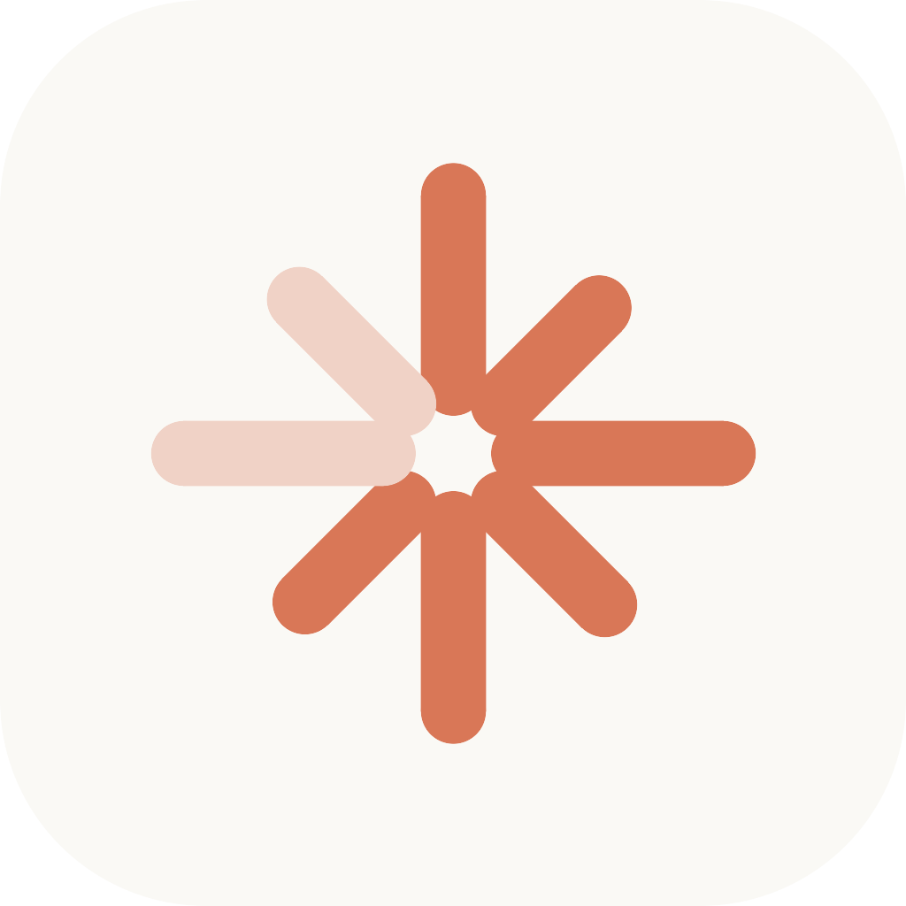

<p align="center">
  
</p>

<h1 align="center">cclimit</h1>

<p align="center"><b>Know before you hit the wall.</b><br>
A native macOS menu bar gauge for Claude Code usage limits — the 5-hour window, the
weekly cap, and a forecast of when you'll run out at your current pace.</p>

---

Unlike usage trackers that report the present, cclimit forecasts the wall:

- **5-hour window** — while you're actually burning, it answers the real question:
  *"At this pace: wall in ~40 min — before reset (1 h 10 m)."* When you're idle it stays
  quiet instead of extrapolating noise.
- **Weekly cap** — a day-level range (*"at this week's pace: Thu–Fri"*), never a
  false-precision timestamp.
- **Per-project attribution** — which project/agent ate today's window, from local
  Claude Code transcripts (relative shares; the gauges themselves always come from
  server truth).

## How it works

cclimit reads the OAuth token Claude Code already stores (macOS Keychain, service
`Claude Code-credentials`, or `~/.claude/.credentials.json`) and polls the same
endpoint that powers Claude Code's own `/usage` command. Server-side authoritative —
correct across devices.

**Trust by architecture:**

- Read-only: never writes to Claude Code's Keychain item or credentials file.
- Tokens live in memory only; the only thing persisted is non-sensitive utilization
  history for the forecast.
- Zero telemetry. No network calls except `api.anthropic.com`.
- Conservative polling (60–120 s active, 5–10 min idle, exponential backoff on 429),
  paused while the screen is locked.

First launch triggers a one-time macOS consent dialog for reading the Keychain item —
that's the OS confirming exactly the access described above.

**Honesty note:** the usage endpoint is undocumented and this use of Claude Code OAuth
tokens (read-only usage metadata, your own token, your own machine) is a gray zone under
Anthropic's third-party token policy. cclimit degrades gracefully if the endpoint
changes; it will never silently show stale data as fresh. Not affiliated with Anthropic.

## Install

Download `cclimit-<version>.dmg` from the [latest release](https://github.com/1fc0nfig/cclimit/releases/latest),
open it, and drag **cclimit** to Applications.

> This build is not yet Apple-notarized, so on first launch macOS Gatekeeper will say it
> "cannot be checked for malicious software." Right-click the app → **Open** → **Open** to
> run it (once). Notarized builds are coming — see [docs/PLAN.md](docs/PLAN.md).

The app keeps itself up to date via [Sparkle](https://sparkle-project.org): it checks
`https://cclimit.app/appcast.xml` and installs signed updates (EdDSA-verified). Toggle
automatic checks — or check now — in **Settings → General → Updates**.

## Local development

Requires Xcode 15+ / Swift 5.9+ on macOS 14+.

```bash
make test      # unit tests (decoding, forecast, backoff, attribution)
make app       # assemble build/cclimit.app (debug, ad-hoc signed)
make run       # build + launch the menu bar app
make release   # release-configuration bundle
make dmg       # build a distributable dist/cclimit-<version>.dmg
```

`swift run` also works for quick iterations, but notifications, launch-at-login, and
auto-update need the real bundle (`make run`). Cutting a release: [docs/RELEASING.md](docs/RELEASING.md).

## Status

Pre-release (v0.1). Auto-update (Sparkle) ships in this build. Apple notarization and a
Homebrew cask are next — see [docs/PLAN.md](docs/PLAN.md) and [docs/product.md](docs/product.md).

MIT © Matyáš Černý
